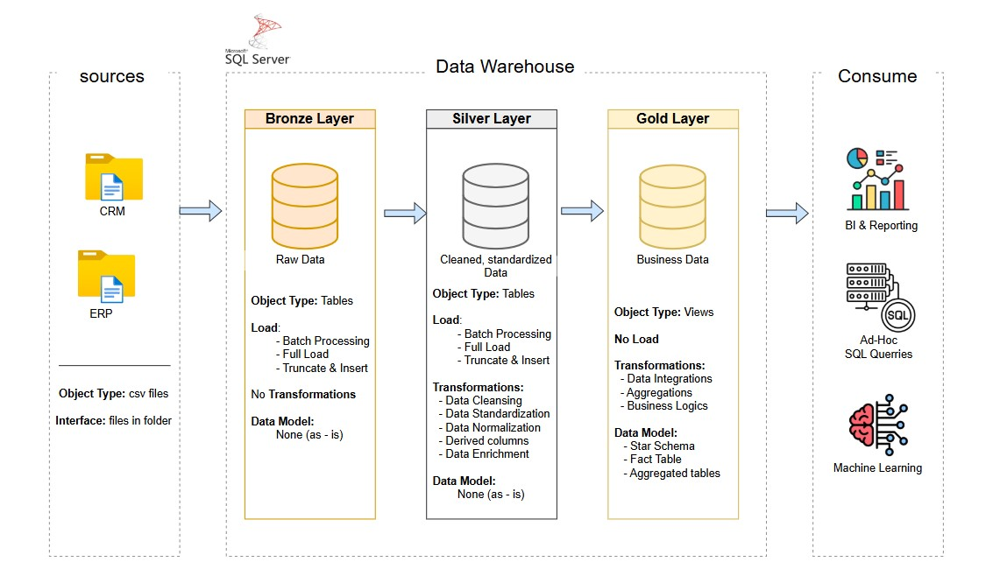

# **Data Warehouse project**

Welcome to the **sql_data_warehouse_project** repository! 🚀

This project demonstrates the construction of a modern data warehouse using SQL Server, encompassing ETL processes and data modeling, and is prepared for analytics.

---
## 🏗️ Data Architecture

The data architecture for this project follows medallion architecture **Bronze**, **Silver** and **Gold** layers:

1. **Bronze Layer:** Stores row data as-is from the system. Data is ingested from CSV files into the SQL Server database.
2. **Silver Layer:** This layer includes data cleansing, standardization, and normalization processes to prepare data for analysis.
3. **Gold Layer:** Houses business-ready data modeled into a star schema required for reporting and analytics.

---
## 📖 Project Overview

This project involves:

1. **Data Architecture**: Designing a Modern Data Warehouse Using Medallion Architecture **Bronze**, **Silver**, and **Gold** layers.
2. **ETL Pipelines**: Extracting, transforming, and loading data from source systems into the warehouse.
3. **Data Modeling**: Developing fact and dimension tables optimized for analytical queries.

---
## 🚀 Project Requirements

### Building the Data Warehouse (Data Engineering)

#### Objective
Develop a modern data warehouse using SQL Server to consolidate sales data, enabling analytical reporting and informed decision-making.

#### Specifications
- **Data Sources**: Import data from two source systems (ERP and CRM) provided as CSV files.
- **Data Quality**: Cleanse and resolve data quality issues before analysis.
- **Integration**: Combine both sources into a single, user-friendly data model designed for analytical queries.
- **Scope**: Focus on the latest dataset only; historization of data is not required.
- **Documentation**: Provide clear documentation of the data model to support both business stakeholders and analytics teams.
